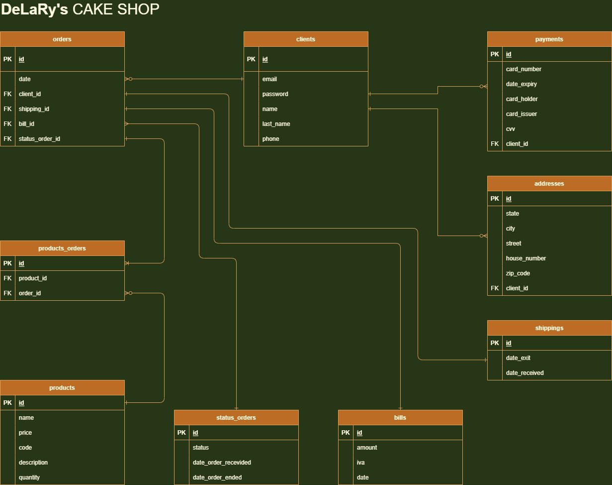

# pastry e-commerce
## Introduction 
##### University project where we will create from scratch a web page that consumes an API.
### what is it?
###### consists of implementing the frontend components as well as the API in the backend.
###### - Java+Spring Boot with JPA/Hibernate.

## Entity-Relationship Model

